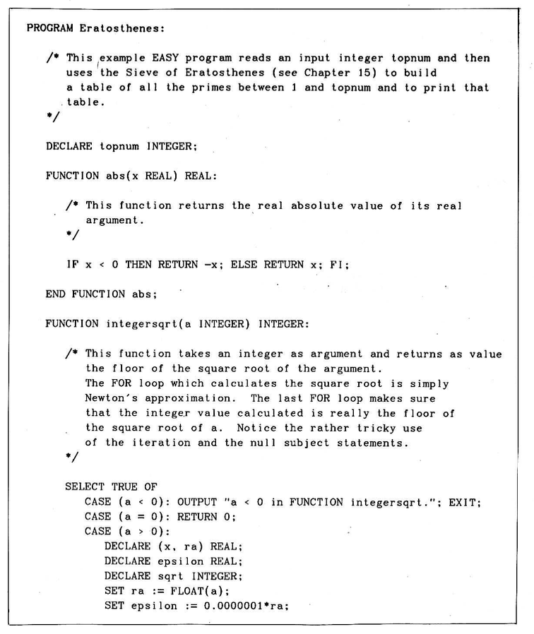

# EASY language compiler

The repository contains a compiler for the educational programming language called Easy, as described in the book [Etudes for Programmers](https://dl.acm.org/doi/10.5555/1096892) (1978) by Charles Wetherell.

NOTE: The compiler is also educational only. The compiler was written from scratch, and I had no compiler-writing experience before. My purpose was to learn compiler implementations and runtimes.

## EASY language intro

The program below is from the book. It is intended to demonstrate the gist of the EASY language. This code was my very first milestone when developing the compiler:

[](sieve1.png)

[](sieve2.png)

Here is the [source](tests/sieve/test.easy) of the program and also the [output of the compiler](tests/sieve/x/test.c).

## Implementation

The compiler is implemented in Typescript. The compiler emits C code, which Clang or GCC then compiles into the native binary. The "runtime.c" file is a bare minimum runtime support. In the `x` subfolders of the tests, there are `test.c` files, representing the output of the compiler.

The compiler requires a Javascript runtime (Node 24+ or Bun) and Clang 17+.

To compile and run a program in Easy, you run "easyc run filename.easy", for example:

```sh
easyc run life.easy
```

or step by step:

```sh
node easyc.ts life.easy && cc life.c -o test -I . && ./test
```

`easyc.ts` compiles [life.easy](tests/life/test.easy) to [life.c](tests/life/x/test.c), and then Clang compiles `easy.c` to the executable.

The Easy language syntax is fully supported, according to the book. However, there are a few points worth mentioning.

`EXTERNAL` subroutines and `NAME` aliases are allowed but not supported semantically.

Multiple `PROGRAM` segments are not supported, and the program should have only one `PROGRAM` segment, which becomes its entry point. The identifiers (type, variables, subroutines) from the `PROGRAM` segment are hoisted to the global namespace and visible in all parts of the Easy program.

According to the book, Easy is a copy semantics language. It means that copying a primitive type, a structure, or an array always makes a full, deep copy. The subroutine arguments and the function return value are also copied deeply to provide the value semantics.

The only exception to the value semantics is the array, whose size is not known at compile time. Such arrays are allocated dynamically, but the copy operation (an assignment, passing as a subroutine argument, or returning as a result from the function) performs a shallow copy (a runtime limitation). Also, the arrays in the top-level `PROGRAM` segment must have a compile-time known size.

The compiler uses C `struct` to implement compound types, such as strings, arrays, and structures.

The compiler implements a handwritten recursive descent parser. However, there is a second experimental PEG parser (`peg.ts` with `easy.peg` grammar file), but this parser is not used to generate code. The PEG parser only runs in testing by `test.ts`. Maybe in the future, PEG will replace the basic recursive descent parser.

## Compiler test pipeline

The compiler project has a test pipeline, `test.ts`, running a set of tests from the `tests` folder. Some of the tests implement well-known programs, such as the Brainfuck interpreter, Conway's Game of Life, Rule 110 automaton, Quine (a program that prints its own source code), Mastermind (utilising Knuth's Minimax algorithm), FizzBuzz, Eratosthenes Sieve (from the book).

The "tests" folder contains compiler tests. Each subfolder is an individual test. Inside each test folder, there is a file named `test.easy`. In the "x" subfolder of the test, there are expected ("golden") files that are expected to be generated by the test.

There are several types of expected files. The main ones are `test.c` and `test.output`. The first is the compiler output. This file is then compiled to `test.exe` by the C compiler. The `test.output` is the console output of the `test.exe` execution. If a test requires console input (such as `sieve`), a `test.input` file is available.

Additionally, a test may have `test.tokens` (lexer tokens), `test.s` (symbol table), `test.json` (AST), and `test.peg.json` (AST from PEG). These files are optional and not all tests use them.

## Testing and running examples

### Prerequisites

- JavaScript runtime: `bun` or `node` (24+) (remember - the compiler is written in TypeScript)
- clang 17+ (to compile the Easy compiler output to a native binary)
- `just` (`make` alternative) - https://just.systems/
- `docker` (optional, if we want to run tests in an isolated container)

Currently, the compiler test pipeline runs either locally by `just test-compiler` or by `just docker-test`.

NOTE: Running tests in the Linux container helps because the Clang memory sanitiser is more capable in Linux, rather than on macOS.

## Examples

Get a feel for the compiler, and run `just life` to play the Convey's Game of Life in the console.

Other examples:

`just run bf` - to run a Brainfuck program printing "EASY!".

`just run fizzbuzz` - FizzBuzz

`just run quine` - the program which prints its source (an etude from the book)

`just run mastermind` - to play Mastermind, so the computer will guess your code using the Knuth's minimax algoright for Mastermind (also an etude from the book about)

`just run sieve` - to run the Eratosthenes Sieve (from the book) - enter a maximum number, and the program will find all primes up to this number.

`just run rule_110` - to run Rule 110 automaton.

## Compiler internals overview

As mentioned above, the compiler utilises a manual recursive descent parser, as specified in the [Easy grammar specification](GRAMMAR.md) from the book.

Each AST node can emit C code in either `c()` or `v()` functions. `v()` function is used by expression nodes. The `v()` function emits C code and also the name of the variable with the result of the expression.

## Related

- [easy-cot.yaml](easy-cot.yml) - syntax highlighting for Easy for the macOS "cot" editor
- <https://github.com/begoon/easy-vscode> - a VSCode extension for Easy syntax highlighting
- <https://github.com/begoon/easy-lsp> - a prototype of the VSCode LSP for Easy (proof of concept)
